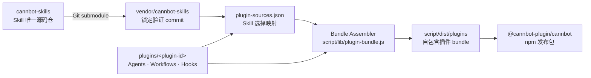
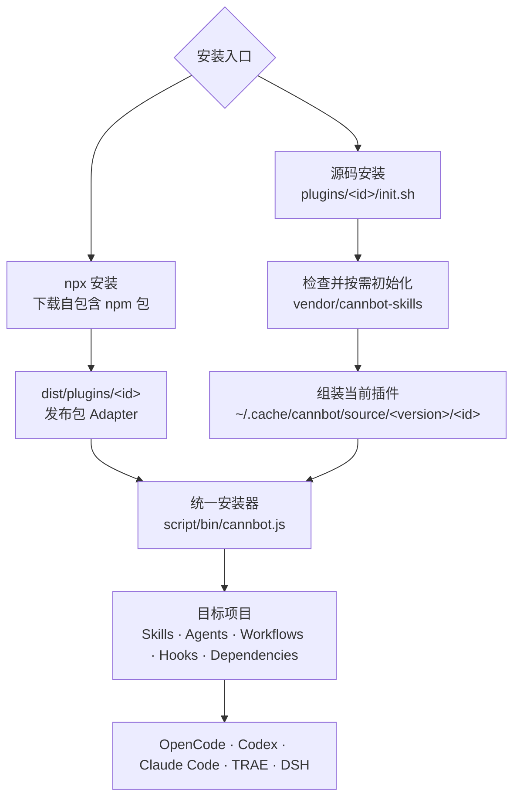

# CANNBot

[](https://www.npmjs.com/package/@cannbot-plugin/cannbot)


🌐 [官方网站](https://cann.cannbot.cn) · 📦 [官方插件](plugins/) · 🧩 [安装与发布](script/) · 📖 [工作流指南](script/docs/cannbot-workflows.md) · 🧠 [CANNBot Skills](https://gitcode.com/cann/cannbot-skills)

---

## 项目概述

**CANNBot** 面向 CANN 与昇腾 NPU 开发场景，提供可组合的 Agent 插件、专业角色和工程工作流，帮助开发者通过自然语言完成算子开发、算子测试、模型迁移与推理优化等任务。

本仓库是 CANNBot 的**插件编排与交付仓库**，主要维护：

- 官方插件的 Agents、Workflows、Hooks、客户端清单与安装声明；
- 面向 OpenCode、Codex、Claude Code、TRAE 和 DSH 的统一安装器；
- npm 自包含发布包的组装、测试与发布流程。

可复用 Skill 源码不在本仓库重复维护，其唯一源码来源是 [cann/cannbot-skills](https://gitcode.com/cann/cannbot-skills)。本仓库通过 Git submodule 锁定经过验证的 Skill 版本，并通过插件声明选择、组装和发布所需能力。

## 仓库定位与分工

| 维度 | 本仓库 `cannbot` | `cannbot-skills` 仓库 |
|------|------------------|----------------------|
| 核心职责 | 插件编排、安装交付、npm 发布 | 可复用 Skill 的设计、实现、测试与治理 |
| 主要资产 | Plugins、Agents、Workflows、Hooks、安装器 | `SKILL.md`、领域知识、脚本、模板、参考资料 |
| 复用方式 | 用 `plugin-sources.json` 声明插件需要的 Skills | 按领域提供稳定、可独立安装的 Skills |
| 版本关系 | 通过 `vendor/cannbot-skills` 锁定确定的 commit | 独立演进并发布新的能力版本 |
| 面向对象 | 插件用户、集成开发者、npm 发布维护者 | Skill 使用者、领域专家、Skill 贡献者 |

职责划分遵循以下原则：

1. **Skill 单一源码**：领域能力只在 `cannbot-skills` 中维护，避免两仓内容漂移。
2. **插件就近编排**：Agents、Workflows、Hooks 和依赖声明与插件放在一起，便于端到端演进。
3. **统一安装实现**：npm 安装与源码安装只在插件 bundle 的来源上不同，后续共用同一安装流程。
4. **可复现发布**：npm 包使用 submodule 锁定的 commit 进行组装，用户安装时不再拉取 Skill 仓库。

## 快速开始

### 前置条件

- Node.js 20 或更高版本；
- OpenCode、Codex、Claude Code、TRAE 或 DSH 中的任意一种；
- 使用源码安装时需要 Git。

### npm 一键安装

在目标项目目录中执行：

```bash
npx @cannbot-plugin/cannbot@latest install ops-direct-invoke --tool opencode
```

完整命令格式：

```bash
npx @cannbot-plugin/cannbot@latest install <plugin-id> \
  --tool <opencode|codex|claude|trae|dsh> \
  --target /path/to/target-project
```

进入目标项目后可以省略 `--target`。

### 源码安装

推荐在克隆主仓时同时拉取 submodule：

```bash
git clone --recurse-submodules --shallow-submodules \
  https://gitcode.com/cann/cannbot.git
cd cannbot/plugins/ops-direct-invoke
bash init.sh
```

`init.sh` 默认使用 OpenCode 并安装到当前目录。安装到其他项目或客户端时传入参数：

```bash
bash init.sh project claude /path/to/target-project
```

如果普通 `git clone` 没有拉取 submodule，源码安装器会在组装插件前自动初始化 `vendor/cannbot-skills`。

## 官方插件

| 插件 | 领域 | 能力说明 |
|------|------|----------|
| [`ops-direct-invoke`](plugins/ops-direct-invoke/) | Ascend C 算子开发 | Kernel 直调开发工作流，覆盖需求分析、方案设计、实现、审查、精度与性能验收 |
| [`ascendc-st-design`](plugins/ascendc-st-design/) | Ascend C 算子测试 | 基于 aclnn 接口文档完成参数定义、测试因子、约束分析及 L0/L1/L2 ST 用例设计 |
| [`model-infer-optimize`](plugins/model-infer-optimize/) | NPU 模型推理 | 从模型迁移、baseline 建立到精度对齐、profiling 分析和端到端性能优化 |

使用 `ascendc-st-design` 的生成脚本还需要 Python 3，以及 PyYAML、NumPy 和 pandas。可以在安装插件后用以下命令检查运行环境：

```bash
python3 -c "import yaml, numpy, pandas"
```

社区插件统一规划在 [`plugins-community/`](plugins-community/) 中，与官方插件保持清晰的准入和发布范围。

## 项目架构

### 双仓协作架构

`plugin-sources.json` 是插件编排仓与 Skill 源码仓之间的关键接口（seam）：Skill 仓可以独立演进，本仓只需要更新 submodule commit 和插件映射，无需复制或修改 Skill 源码。



### 统一安装架构

npm 与源码安装共享一个深模块。两个 Adapter 分别解析“发布包 bundle”和“源码 bundle”，在获得标准插件目录后，Skills、Agents、Workflows、Hooks、依赖仓和客户端配置全部由同一实现完成。



npm 用户安装时不会拉取 `cannbot-skills` submodule；Skill 内容已经在发布前复制进 npm 包。源码用户只有在 submodule 尚未初始化时，才会在执行 `init.sh` 的 bundle 解析阶段拉取 Skill 仓库。

## 目录规划

```text
cannbot/
├── plugins/                         # 官方插件编排与发布定义
│   └── <plugin-id>/
│       ├── .claude-plugin/          # Claude Plugin manifest
│       ├── .codex-plugin/           # Codex Plugin manifest
│       ├── agents/                  # 专业角色定义
│       ├── workflows/               # 端到端工作流与模板
│       ├── hooks/                   # 可选客户端 Hooks
│       ├── AGENTS.md                # 插件级协作说明
│       ├── plugin-sources.json      # Skill 仓映射
│       ├── plugin-install.json      # 可选依赖仓声明
│       └── init.sh                  # 源码安装薄入口
├── plugins-community/               # 社区插件预留目录
├── script/                          # npm 工程与统一安装模块
│   ├── bin/                         # CLI 与源码安装 Adapter
│   ├── lib/                         # 插件 bundle 组装模块
│   ├── scripts/                     # 构建脚本
│   ├── test/                        # 安装行为测试
│   └── docs/                        # 安装和工作流文档
└── vendor/
    └── cannbot-skills/              # Skill 仓 Git submodule
```

### 插件目录契约

| 文件或目录 | 是否必需 | 作用 |
|------------|----------|------|
| `.claude-plugin/plugin.json` | 是 | 插件 ID、版本、描述、Skills 与 Agents 清单 |
| `.codex-plugin/plugin.json` | 是 | Codex 插件发现与展示元数据 |
| `plugin-sources.json` | 是 | 将插件声明映射到 Skill 仓中的具体路径 |
| `init.sh` | 是 | 源码安装入口，仅负责转交插件、工具、目标和源码位置 |
| `AGENTS.md`、`agents/` | 可选 | 插件级指令与专业角色 |
| `workflows/`、`hooks/` | 可选 | 工作流资产和客户端生命周期扩展 |
| `plugin-install.json` | 可选 | 插件所需外部依赖仓及项目暴露路径 |

## Submodule 与发布流程

### Skill 版本映射

每个插件通过 `plugin-sources.json` 指定 Skill 仓和所需目录，例如：

```json
{
  "skillsRepository": "vendor/cannbot-skills",
  "skills": [
    "ops/ascendc-st-design"
  ]
}
```

构建器会校验插件 manifest 与映射文件中的 Skill 集合是否一致，并拒绝缺失、越界或重复的 Skill 路径。

### npm 发布

```bash
git submodule update --init --recursive --depth 1
npm --prefix script test
npm --prefix script run build:plugins
npm --prefix script run pack:check
npm --prefix script run pack:smoke
```

执行 `npm publish` 时，`prepublishOnly` 会先运行完整测试和实际 tgz 安装 smoke test，`prepack` 再重新组装 `script/dist/plugins/`。发布产物包含完整 Skill 内容，因此 npm 用户获得的是可离线解析的固定版本 bundle。

### 更新 Skill 版本

1. 执行 `npm --prefix script run skills:update` 显式拉取 `cannbot-skills/master` 最新提交；
2. 核对各插件的 `plugin-sources.json`；
3. 运行完整安装测试和打包检查；
4. 提交新的 submodule gitlink；
5. 按语义化版本规则更新并发布 npm 包。

普通构建和发布始终使用 gitlink 锁定的 Skill 提交，不会自动跟随远程分支，以保证产物可复现。

## 开发与验证

```bash
# 完整测试：覆盖源码/发布包两种来源和五种客户端
npm --prefix script test

# 重新组装插件 bundle
npm --prefix script run build:plugins

# 检查 npm 发布内容
npm --prefix script run pack:check

# 通过实际 tgz 和 npm bin 验证安装
npm --prefix script run pack:smoke
```

测试以统一安装器的外部 interface 为主要验证面，覆盖 Skills/Agents 复制、工作流资产、Claude Hooks、重复安装、依赖仓声明以及源码 `init.sh` Adapter。

## 修改应该提交到哪里

| 修改类型 | 提交位置 |
|----------|----------|
| Skill 知识、脚本、模板或参考资料 | [`cannbot-skills`](https://gitcode.com/cann/cannbot-skills) |
| 官方插件的 Agents、Workflows、Hooks 或 Skill 组合 | 本仓库 [`plugins/`](plugins/) |
| 社区插件 | 本仓库 [`plugins-community/`](plugins-community/) |
| npm 安装、bundle 组装或客户端适配 | 本仓库 [`script/`](script/) |
| Skill 版本升级 | Skill 仓先合入，本仓再更新 submodule gitlink |

## 许可证与免责声明

- 本仓库默认适用根目录 [`LICENSE`](LICENSE) 中的 CANN Open Software License Agreement Version 2.0，官方插件使用相同许可证。
- npm 包为混合许可证分发：安装器实现适用 MIT License，组装的官方插件和 Skills 保留各自许可证，详见 [`script/LICENSE`](script/LICENSE) 及各插件产物中的许可文件。
- submodule 内容遵循 `cannbot-skills` 仓库自身的许可证。

CANNBot 生成或修改的代码仍需开发者完成编译、测试、精度验证、性能验证和安全审查后再投入使用。
