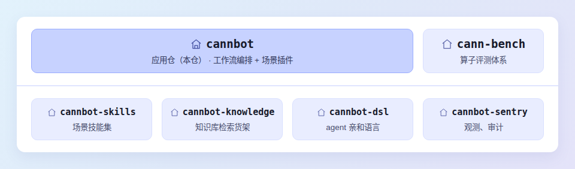

# CANNBot

[](https://www.npmjs.com/package/@cannbot-plugin/cannbot)

## 🚀 概述

CANNBot 是 [CANN](https://hiascend.com/software/cann) 社区的 Infra 智能体层，用 Agent 完成 AscendC/PyPTO/TileLang/Triton 等各类语言的算子开发、模型迁移与推理优化，并延伸至图模式、Runtime 等更多 CANN 开发场景。

本仓（cannbot）是其应用仓与用户入口，提供工作流编排与场景插件；仓群还包括 [cannbot-skills](https://gitcode.com/cann/cannbot-skills)、[cannbot-knowledge](https://gitcode.com/cann/cannbot-knowledge)、[cannbot-dsl](https://gitcode.com/cann/cannbot-dsl)、[cann-bench](https://gitcode.com/cann/cann-bench)、[cannbot-sentry](https://gitcode.com/cann/cannbot-sentry) 等仓库，结构如下。



## ⚡ 快速开始

### npm 安装

```bash
npx @cannbot-plugin/cannbot@latest install ${plugin} --tool opencode
```

### 源码安装

```bash
git clone --recurse-submodules --shallow-submodules https://gitcode.com/cann/cannbot.git
cd cannbot/plugins/${plugin}
bash init.sh
```

`${plugin}`：插件名称，见[官方插件](#-官方插件)，例如 `ops-direct-invoke`。

## 📦 官方插件

| 插件 | 能力 |
|------|------|
| [`ops-direct-invoke`](plugins/ops-direct-invoke/) | skill 驱动的多角色直调算子开发工作流：8 阶段 7 CP 全流程、静默模式、可插拔流程插件、算子仓继承定制 |
| [`ascendc-st-design`](plugins/ascendc-st-design/) | Ascend C 算子 L0/L1/L2 ST 用例设计 |
| [`model-infer-optimize`](plugins/model-infer-optimize/) | NPU 模型迁移、精度对齐与推理性能优化 |

## 📖 文档

- [插件安装与工作流](script/docs/cannbot-workflows.md)
- [仓库架构与维护](docs/repository-guide.md)
- [插件目录说明](plugins/README.md)
- [npm 构建与发布](script/README.md)

## 💬 相关信息

- [问题反馈](https://gitcode.com/cann/cannbot/issues)
- [许可证](LICENSE)
