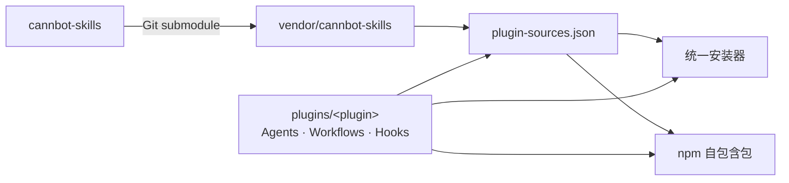

# CANNBot 仓库架构与维护

## 仓库定位

本仓库维护：

- 官方插件的 Agents、Workflows、Hooks、客户端清单与安装声明；
- 面向 OpenCode、Codex、Claude Code、TRAE 和 DSH 的统一安装器；
- npm 自包含发布包的组装、测试与发布流程。

可复用 Skill 源码由 [cannbot-skills](https://gitcode.com/cann/cannbot-skills) 维护。本仓库通过 Git submodule 锁定 Skill 版本，并通过插件声明选择所需能力。

| 维度 | `cannbot` | `cannbot-skills` |
|------|-----------|------------------|
| 核心职责 | 插件编排、安装交付、npm 发布 | Skill 设计、实现、测试与治理 |
| 主要资产 | Plugins、Agents、Workflows、Hooks、安装器 | `SKILL.md`、领域知识、脚本、模板、参考资料 |
| 复用方式 | `plugin-sources.json` 声明插件所需 Skills | 按领域提供可独立使用的 Skills |
| 版本关系 | `vendor/cannbot-skills` 锁定确定的 commit | 独立演进 |

## 架构

`plugin-sources.json` 是插件与 Skill 源码之间的映射接口。源码安装将 Skill 链接到 submodule；npm 发布前将 Skill 复制进自包含包。



源码执行 `plugins/<plugin>/init.sh` 时，安装器按需初始化 submodule，并在目标客户端目录创建相对 Skill 软链。npm 安装直接使用发布包内的 Skill 副本，不依赖 submodule。

## 目录结构

```text
cannbot/
├── plugins/                         # 官方插件
│   └── <plugin>/
│       ├── .claude-plugin/          # Claude Plugin manifest
│       ├── .codex-plugin/           # Codex Plugin manifest
│       ├── agents/                  # 专业角色定义
│       ├── workflows/               # 工作流与模板
│       ├── hooks/                   # 客户端 Hooks
│       ├── AGENTS.md                # 插件级协作说明
│       ├── plugin-sources.json      # Skill 映射
│       ├── plugin-install.json      # 外部依赖声明
│       └── init.sh                  # 源码安装入口
├── plugins-community/               # 社区插件
├── script/                          # npm 工程与统一安装器
│   ├── bin/
│   ├── lib/
│   ├── scripts/
│   ├── test/
│   └── docs/
└── vendor/
    └── cannbot-skills/              # Skill 仓 Git submodule
```

## 插件目录契约

| 文件或目录 | 是否必需 | 作用 |
|------------|----------|------|
| `.claude-plugin/plugin.json` | 是 | 插件名称、版本、描述与 Agents 清单 |
| `.codex-plugin/plugin.json` | 是 | Codex 插件发现与展示元数据 |
| `plugin-sources.json` | 是 | Skill 仓路径、安装模式与 Skill 清单 |
| `init.sh` | 是 | 源码安装入口 |
| `AGENTS.md`、`agents/` | 可选 | 插件指令与专业角色 |
| `workflows/`、`hooks/` | 可选 | 工作流资产与客户端扩展 |
| `plugin-install.json` | 可选 | 外部依赖仓及项目暴露路径 |

Skill 映射示例：

```json
{
  "skillsRepository": "vendor/cannbot-skills",
  "skillInstallMode": "symlink",
  "skills": [
    "ops/ascendc-st-design"
  ]
}
```

## npm 发布

```bash
git submodule update --init --recursive --depth 1
npm --prefix script test
npm --prefix script run build:plugins
npm --prefix script run pack:check
npm --prefix script run pack:smoke
```

`prepublishOnly` 运行完整测试和实际 tarball 安装测试，`prepack` 重新组装 `script/dist/plugins/`。发布产物包含完整 Skill 内容。

## 更新 Skill 版本

1. 执行 `npm --prefix script run skills:update`；
2. 核对各插件的 `plugin-sources.json`；
3. 运行完整安装测试和打包检查；
4. 提交新的 submodule gitlink；
5. 更新 npm 版本并发布。

普通构建和发布使用 gitlink 锁定的 Skill commit，不自动跟随远程分支。

## 开发与验证

```bash
npm --prefix script test
npm --prefix script run build:plugins
npm --prefix script run pack:check
npm --prefix script run pack:smoke
```

测试覆盖源码与 npm 两种来源、五种客户端、Skills、Agents、Workflows、Claude Hooks、重复安装、依赖仓和源码 `init.sh`。

## 修改位置

| 修改类型 | 提交位置 |
|----------|----------|
| Skill 知识、脚本、模板或参考资料 | [`cannbot-skills`](https://gitcode.com/cann/cannbot-skills) |
| 官方插件内容或 Skill 组合 | [`plugins/`](../plugins/) |
| 社区插件 | [`plugins-community/`](../plugins-community/) |
| npm 安装、组装或客户端适配 | [`script/`](../script/) |
| Skill 版本升级 | Skill 仓先合入，本仓再更新 submodule gitlink |

## 许可证与免责声明

- 本仓库默认适用根目录 [LICENSE](../LICENSE) 中的 CANN Open Software License Agreement Version 2.0。
- npm 安装器实现适用 MIT License；官方插件和 Skills 保留各自许可证，详见 [`script/LICENSE`](../script/LICENSE)。
- submodule 内容遵循 `cannbot-skills` 仓库许可证。

CANNBot 生成或修改的代码需由开发者完成编译、测试、精度验证、性能验证和安全审查后再投入使用。
