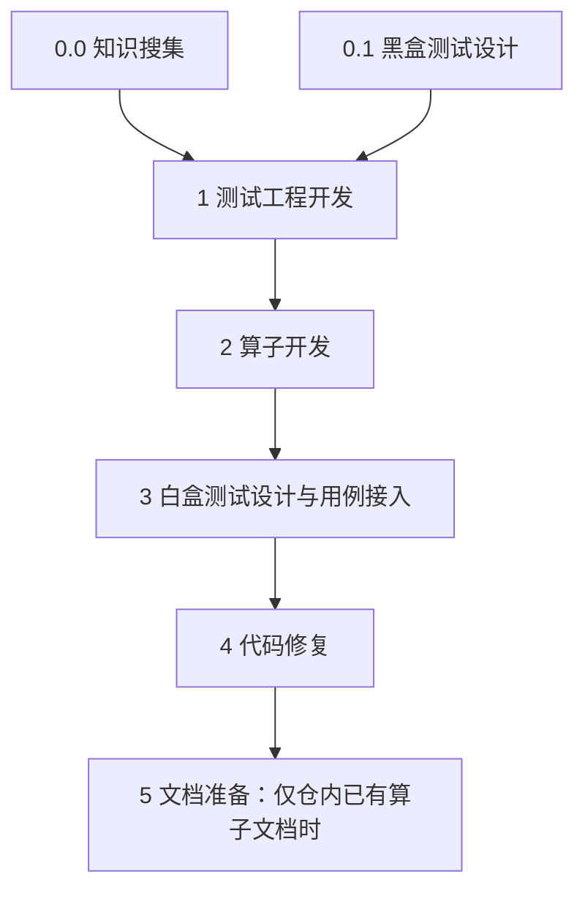

# ops-direct-invoke

## 新特性

### 【2026-09-30】

- 新增 **CANNBot-DSL 算子开发支持**：按开发语言选择 DSL 工作流，支持设计、动态实现子图生成、开发与验收。
- DSL 的环境节点检查环境后生成对应 wheel 的 API 参考；性能优化完成后再生成最终版本的文档。
- 提供 `ops-direct-invoke-maintain`，按模块记录工作流设计与维护约定。
- 回归测试随维护 Skill 分发，修改工作流后运行完整测试；检查自身脚本和 harness 调用衔接，不重复验证框架内部调度。
- 安装与使用统一见 [QUICKSTART.md](QUICKSTART.md)。

## 功能概览

`ops-direct-invoke` 提供直调算子的需求对齐、方案设计、实现、功能验收、代码检视和交付文档流程。插件名称、安装 ID 与入口 Skill 名称统一为 `ops-direct-invoke`。

**调度交给 harness，知识交给 Skill，Workflow 专注于流程。** 工作区 PM 按用户的实际目标规划子 Agent 合作，通过 harness 执行 workflow YAML。算子需求对齐时必须加载 `repo-requirement` Skill，按其中的要求执行；算子开发时必须加载 `ops-direct-invoke` Skill，按其中的要求执行。每个 task 同时声明执行与验收；运行期派发、并行及同节点重试使用框架原生机制。

安装与首次使用见 [QUICKSTART.md](QUICKSTART.md)。

## 设计思想与入口

插件的 [AGENTS.md](AGENTS.md) 是常驻工作区的通用 PM 指引，直接描述需求拆解、子 Agent 协作、工作流启动与多轮交付，不再通过 PM 角色文件转接。初始化时，安装器将其正文写入工作区 `AGENTS.md` 的插件管理区块，保留用户原有内容；Claude 使用 `CLAUDE.md`。重复初始化替换同一管理区块，不重复追加。

算子开发任务由 PM 加载 `ops-direct-invoke` Skill，按其中的要求执行。所有子 Agent 必须在 Workflow YAML 落盘后由 harness 拉起。`agents/` 只保留 `ops-direct-invoke-architect`、`ops-direct-invoke-developer`、`ops-direct-invoke-verifier` 三个真实 Agent，分别安装为 Codex 的 TOML 或 OpenCode、Claude 的 Markdown 角色配置。CANNBot-DSL 的“环境检查”“需求分析”“黑盒设计”“代码检视”等是节点职责，不是独立 Agent；静态工作流与动态实现子图的 `executor`/`verifier` 必须引用上述三个完整角色名，未知角色会在生成时拒绝。

每个任务、每轮 Workflow 独立存放 YAML 和运行记录：

```text
.cannbot/任务1/
├── workflow1/
│   ├── workflow1.yaml
│   ├── 需求与交付件
│   └── .workflow/
└── workflow2/
    ├── workflow2.yaml
    ├── 本轮输入与交付件
    └── .workflow/
```

仓库首次环境检查结果存放在 `.cannbot/环境信息.md`，检查日志存放在 `.cannbot/环境检查/`。后续算子开发直接复用已有通过记录，不重复探测环境；每轮复制为 `work_dir/环境信息.md`，运行中只读。

当前 Workflow 目录的绝对路径即 `work_dir`。首轮未满足交付要求时，PM 根据缺口规划下一轮，保留旧 YAML、状态及验收证据。下一轮明确引用或复制有效输入，并重新验收受影响交付件；同一轮中断恢复则沿用原目录和原 YAML。

## 从需求到执行

- 需求对齐：必须加载 [repo-requirement](skills/repo-requirement/SKILL.md) Skill，按其中的要求执行。
- 启动前环境检查由 PM 负责：必须加载 [repo-env-check](skills/repo-env-check/SKILL.md) Skill，按其中的要求执行。
- 算子开发：必须加载 [ops-direct-invoke](skills/ops-direct-invoke/SKILL.md) Skill，按其中的要求执行。
- Workflow 执行：必须加载 [workflow-orchestrator](../../harness/workflow-orchestrator/SKILL.md) Skill，按其中的要求执行。

## 默认流程与角色

需求确认与 PM 环境检查在工作流启动前完成。PM 先核对路线依据和 Skill 调用契约；路线明确时使用 basic，有关键实现疑点时先独立运行 [feasibility](skills/ops-direct-invoke/workflows/ascendc/feasibility.yaml)。穿刺交付最小代码、代表用例的真实编译与设备证据，通过后新开一轮 basic；规则冲突先澄清，不靠穿刺绕过。basic 默认包含 7 个普通节点，知识搜集可以省略或用前轮资料替代；仓内没有已有算子文档时，下发前从本轮图省略最后的文档准备节点：



知识搜集形成中立补充文档，包含资料索引、API 组合和不同 shape 的初版 Tiling 草稿，开发可根据验证调整实现。算子开发通过 `knowledge_documents` 接收本轮或前轮文档路径；无资料时使用默认值“无补充文档。”，不要求工作流存在知识搜集节点。省略知识节点时删去相应依赖，将黑盒设计编号改为 `0`、测试工程依赖改为 `0`，同步更新知识文档变量，其他阶段仍为 `1`～`5`。测试工程先准备黑盒，算子实现后再按源码生成白盒用例并直接接入已有框架。白盒节点检查测试质量与证据，发现的算子缺陷交给默认编排的代码修复节点；代码修复要求全量黑盒、白盒回归及代码检视通过，没有缺陷且已有当前版本的有效全量证据时复用并记录依据，不强制重复构建或测试；证据缺失或失效时补齐验证。

[generate_workflow_guide.py](skills/ops-direct-invoke/scripts/generate_workflow_guide.py) 扫描模板并生成本轮 `workflow-guide.csv`，列出模板文件名和调用时机。PM 先生成并读取引导，再打开匹配模板。调用时机由各模板第二行的 `use_when` 维护，组装后不传给 harness。basic 与 feasibility 各自维护引用图，每个节点声明 id、task YAML、depends_on、max_retries，以及 task 需要的 variables 赋值。task 内容由组装脚本读取并展开，默认每个节点允许 3 次重试（含首次执行最多 4 轮），重试次数由 PM 在下发时确定。固定必需 Skill 保留在 task；PM 仅对声明了 `executor_skills`、`verifier_skills` 的 task 下发专项必需项，以及开发、修复阶段的有限候选清单与触发条件。节点按实际证据选用候选并记录依据，必需能力缺口或已确认约束、范围变更需求写入报告，交付标准无法满足时验收失败。运行中不与 PM 或用户交互；PM 在整轮退出后处理阻塞及知识搜集建议，供下一轮编排使用，不修改已启动的 YAML。AscendC 的文档准备按仓内已有格式补全资料，无已有算子文档时可省略该节点；DSL 文档节点按其交付契约生成本轮文档。入口 [SKILL.md](skills/ops-direct-invoke/SKILL.md) 规定模板选择与使用方法。

| 角色 | 职责 |
|---|---|
| [工作区 PM](AGENTS.md) | 理解用户目标、规划协作与多轮交付；不进入 task 图 |
| [ops-direct-invoke-architect](agents/ops-direct-invoke-architect.md) | 需求、规格、黑盒设计、方案、实现规划与任务拆分 |
| [ops-direct-invoke-developer](agents/ops-direct-invoke-developer.md) | 工作区、环境、代码实现与修复、精度和性能验证、文档及交付 |
| [ops-direct-invoke-verifier](agents/ops-direct-invoke-verifier.md) | 需求/规格/方案/设计与通用验收，以及代码检视；不重复构建或运行测试 |

节点通过 `executor` / `verifier` 名称引用安装后的客户端角色，不在 prompt 中额外读取角色文件。工作区常驻指引与运行期子 Agent 派发是两个层次；实际 provider 是否正确加载角色、Skill 和权限仍需真实调用验证。

执行者提供原始构建日志、本阶段测试结果（穿刺代表用例、正式交付全量）、源码/测试/构建产物哈希及实际加载路径，使用 [测试执行记录模板](skills/ops-direct-invoke/templates/测试执行记录.md)。验收者核对证据是否真实、完整、对应当前版本并独立检视代码；证据不足则失败，不代跑测试补证据。所有节点均按 [验收报告模板](skills/ops-direct-invoke/templates/验收报告.md) 生成 `<节点ID>-验收报告.md`，其中记录结论及具体修改意见。共享 acceptance 只列执行者交付件；验收报告由 verifier 在 procedure 中生成并检查，executor 根据回传反馈按需读取详情，不代写或等待它。

穿刺代码、测试入口及证据通过本轮任务 prompt 传入下一轮，并明确使用节点，知识资料通过 `knowledge_documents` 传入；记录绝对路径、版本及适用范围，复用有效产物而非重复调查。穿刺通过仅证明限定范围可行，正式交付仍须全量测试和代码检视。

报告保留关键结论和证据路径，每次真实执行的输入/版本清单、原始日志与用例明细只存一份；后续节点引用并核对差异，每个验收者仍独立出具本阶段报告。返工依据 harness 回传的失败摘要，按需读取所引用报告的未解决项，并补充变更证据；版本变化使旧证据失效时重新验证。确定性阻塞未变时只记录条件复核，当前 harness 仍按预算重试，不能凭报告自动跳过重试。

固定绑定采用与当前节点契约兼容的仓库能力：工程骨架由 `repo-op-templates` 承担，白盒方法由 `repo-test-develop` 承担。`ascendc-direct-invoke-template` 和 `ascendc-whitebox-design` 不再是默认任务的固定项；安装可用不等于必须调用。PM 为补充项核对完整契约，不向禁止交互和派发的节点绑定仍要求这些操作的 Skill，也不靠局部豁免后强行调用。

公共 Skill 的规则由来源仓维护；本插件只调整绑定与流程，不复制或覆盖其规则。已知 Ascend 950 路由组合问题见 [cannbot-skills #688](https://gitcode.com/cann/cannbot-skills/issues/688)。

## 任务、模板与运行接口

必须加载 [ops-direct-invoke](skills/ops-direct-invoke/SKILL.md) Skill，按其中的要求执行。

- [任务定义](skills/ops-direct-invoke/tasks/)
- [引导生成脚本](skills/ops-direct-invoke/scripts/generate_workflow_guide.py)
- [文档模板](skills/ops-direct-invoke/templates/)
- [组装脚本](skills/ops-direct-invoke/scripts/assemble_workflow.py)
- [启动脚本](skills/ops-direct-invoke/scripts/run_workflow.py)

## 知识与范围

Skill 正文及 references 仅包含自身职责，不互相调用或路由；跨 Skill 组合由 PM 或 task 的 approach/procedure 显式声明。引用处只保留加载条件、Skill 名称及按其要求执行，不复制内部步骤或规则。节点输入、产物路径和验收结果由 task 声明；资源目录引用用于定位文件，不代表调用其所属 Skill。公共领域 Skill 来自 vendor，harness 和统一安装器作为公共基础设施使用。

角色、task、脚本、仓库知识及交付模板均由本插件独立维护，安装与运行使用本目录声明的资产及公共依赖。

本仓 `repo-*` 知识按 CANN Bench 的直调工程与评测契约组织，包含需求、环境、接口、模板、构建、测试和编码规则。初始化会获取 `cann-bench` 到 `.cannbot/dependencies/ops-direct-invoke/cann-bench/`，实际运行记录所用 commit；已有 checkout 可作为任务输入复用。跨仓定制继续通过同名 `repo-*` Skill 覆写，不将仓库知识复制进 task。

AscendC basic 的范围为本地开发、功能验收与交付文档；DSL op-dev 还包含性能采集、优化及回归。两者均不包含 PR、外部 CI 或合并。需求阶段仍需如实记录性能诉求；用户要求的硬门槛超出当前执行范围时，先对齐交付安排，不能承诺本流程已验证性能。引用业务知识时不启用其中遗留的 PM 派发、状态维护或回退指令。

## 维护与验证

修改相关组件前加载 [ops-direct-invoke-maintain](skills/ops-direct-invoke-maintain/SKILL.md)，按模块资料维护设计，并检查 README 与 QUICKSTART 一致性。

每次工作流改动后，在应用仓根目录完整运行：

```bash
python3 plugins-official/ops-direct-invoke/skills/ops-direct-invoke-maintain/test/ut/test_all.py
```

测试验证引导、组装、变量、DSL 设计与子图生成，以及启动参数和全部模板到 harness 的接口冒烟。harness 作为可信依赖，不在插件中重复测试重试、回滚与反馈状态机；也不固定节点数量、Skill 数量、业务顺序或提示词措辞。测试设计与边界见 [测试体系](skills/ops-direct-invoke-maintain/reference/tests.md)，依赖与安装后运行方式见 [QUICKSTART](QUICKSTART.md#维护后的回归)。测试通过不代表真实 Agent 行为或 NPU 算子验证已通过。

安装与打包集成测试仍位于应用仓 `script/test/`，不属于本次迁移的插件回归测试。

## 目录与接口

```text
ops-direct-invoke/
├── AGENTS.md                       # 工作区 PM 的通用指引
├── README.md                       # 新特性、设计与功能
├── QUICKSTART.md                   # 安装与使用
├── agents/                         # architect / developer / verifier
├── init.sh                         # 统一安装器的薄入口
├── plugin-sources.json             # 公共 Skill 来源与安装方式
├── plugin-install.json             # 外部依赖仓声明
└── skills/
    ├── ops-direct-invoke-maintain/
    │   ├── SKILL.md                 # 维护入口与完整回归要求
    │   ├── reference/               # 模块设计与维护方法
    │   └── test/ut/                 # 所有维护回归测试
    ├── repo-env-check/             # PM 的启动前环境检查
    ├── repo-requirement/
    │   ├── SKILL.md
    │   └── references/requirement-checklist.md
    ├── ops-direct-invoke/
    │   ├── SKILL.md                 # 先生成引导，再选用模板
    │   ├── scripts/
    │   │   ├── generate_workflow_guide.py
    │   │   ├── assemble_workflow.py
    │   │   └── run_workflow.py
    │   ├── tasks/
    │   │   ├── ascendc/             # <步骤名>.yaml，不带编号
    │   │   ├── cannbot-dsl/
    │   │   └── common/
    │   ├── workflows/
    │   │   ├── cannbot-dsl/          # op-dev 主图与展示资料
    │   │   └── ascendc/
    │   │       ├── basic.yaml       # 正式开发，含 use_when
    │   │       └── feasibility.yaml # 独立技术穿刺，含 use_when
    │   └── templates/              # 文档模板平铺，文件名不带编号
    ├── repo-knowledge/
    ├── repo-build-guide/
    ├── repo-op-templates/
    ├── repo-coding-rules/
    └── repo-test-develop/
```
